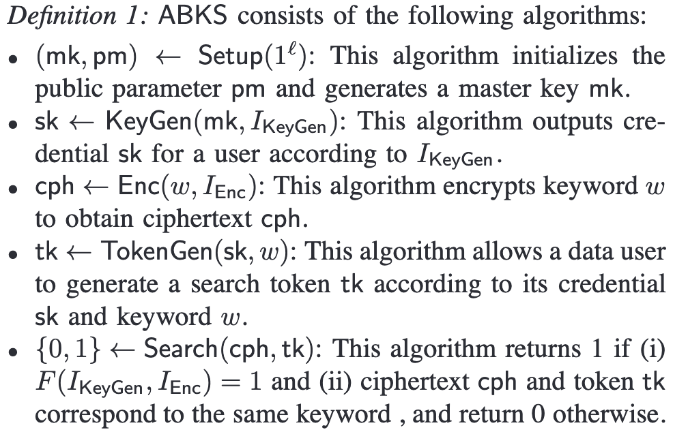

# 背景与定义
属性基加密（ABE, Attribute-Based Encryption） 和 可搜索加密（SE, Searchable Encryption） 是密码学中两大关键技术：

- ABE 允许数据基于用户属性（如角色、部门、安全等级）实现细粒度访问控制，加密数据仅能被满足特定属性策略的用户解密。

- SE 支持在加密数据上直接执行关键字搜索，无需解密，解决了云端数据隐私与检索效率的矛盾。

- ABKS（Attribute-Based Keyword Search） 将两者结合，实现基于属性的关键字搜索：用户仅在其属性满足访问策略时，才能对加密数据执行关键字检索。其核心目标是在保障数据机密性、访问控制的前提下，支持高效的关键字搜索功能。

# 系统模型与关键技术
## 系统角色
- 数据拥有者（Data Owner）：加密数据并指定访问策略（如 (医生 AND 科室A) OR 急诊权限）。

- 云服务器（Cloud Server）：存储加密数据，并根据用户请求执行搜索操作。

- 数据用户（Data User）：提交关键字搜索请求，需通过属性授权获取搜索令牌。

## 算法定义

# 安全需求与挑战
## 安全模型
密文不可区分性（IND-CPA）：攻击者无法从密文中推断明文信息。

关键字隐私性：云服务器无法获知搜索关键字的具体内容。

抗合谋攻击：多个用户无法联合属性集突破访问策略限制。

## 主要挑战
效率与计算开销：双线性对和复杂策略导致加密/搜索延迟较高。

动态策略更新：如何在策略变更时避免重新加密全部数据。

隐私泄露风险：搜索模式可能暴露用户意图。

# 代表性工作

## VABKS: Verifiable attribute-based keyword search over outsourced encrypted data

单关键字、私有可验证、不保护访问策略、不抵御 KGA、单策略、无解密

## Protecting your right: Verifiable attribute-based keyword search with fine-grained owner-enforced search authorization in the cloud

单关键字（可拓展为合取）、私有可验证、不保护访问策略、不抵御 KGA、单策略、无解密

## Hidden policy ciphertext-policy attribute-based encryption with keyword search against keyword guessing attack

单关键字、隐藏访问策略、单策略、无解密

实际上不能抵御 KGA，文章中考虑的 KGA 假设在敌手知道密文的访问策略后，才对所有关键字一一生成密文去和trapdoor执行匹配算法。然而，敌手可以把密文中的访问策略设置为all-or-gate，可以很容易地逃过匹配算法中的属性和访问策略验证，进而匹配关键字。

## Practical Attribute-Based Multi-Keyword Search Scheme in Mobile Crowdsourcing

多关键字、不保护访问策略、不能抵御 KGA、单策略、无解密、支持数值比较

## Multi-authority attribute-based keyword search over encrypted cloud data

单关键字、不保护访问策略、不能抵御 KGA、单策略、多机构、外包解密、online/offline encryption

## CP-ABSE: A Ciphertext-Policy Attribute-Based Searchable Encryption Scheme
    IEEE Access

单关键字、不能抵御 KGA、单策略构造、无解密

## Attribute-Based Hybrid Boolean Keyword Search over Outsourced Encrypted Data
    TDSC'18

**支持布尔查询**、不保护访问策略、实际上不能抵御 KGA、双策略、无解密、支持数值比较

在实验部分和下一篇文章进行了对比

## :sweat_smile: Authorized Keyword Search on Encrypted Data
    ESORICS'14

基于双策略 ABE 构造，**支持布尔查询**，但是搜索令牌生成由 authority 执行，即每次搜索都需要 authority 参与，无解密算法，且无法抵御KGA

## BC-SABE: Blockchain-Aided Searchable Attribute-Based Encryption for Cloud-IoT

单关键字查询，区块链负责密钥分发

## Privacy-Preserving Attribute-Based Keyword Search in Shared Multi-owner Setting
    TDSC'21

单关键字、可追溯、抵御KGA的思想和Qiu2017Hidden一样

## Multi-Keyword Searchable and Verifiable Attribute-Based Encryption over Cloud Data
    TCC'21

多关键字合取、不可抵御KGA、

## :sweat_smile: Privacy-preserving attribute-keyword based data publish-subscribe service on cloud platforms
    Information Sciences 2017

基于双策略ABE、外包解密

抵制 Offline KGA：为DO和DU都生成私钥，在加密算法中，DO在加密时，使用系统公钥和该私钥生成密文，Search算法中，通过配对消去该私钥，保证服务器无法生成密文以发起KGA攻击。

1. DO和DU的身份不可互换
2. 该方案只支持DO诚实的情况，无法抵御任意一个DO发起的KGA攻击

