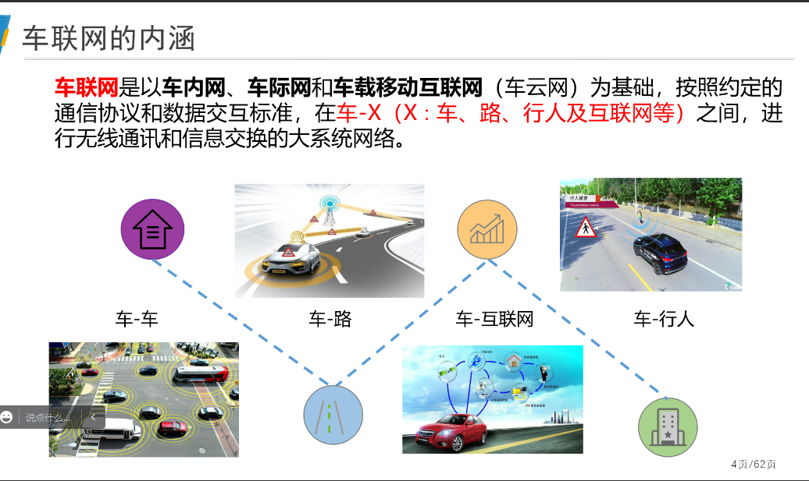

# 架构
## 感知层
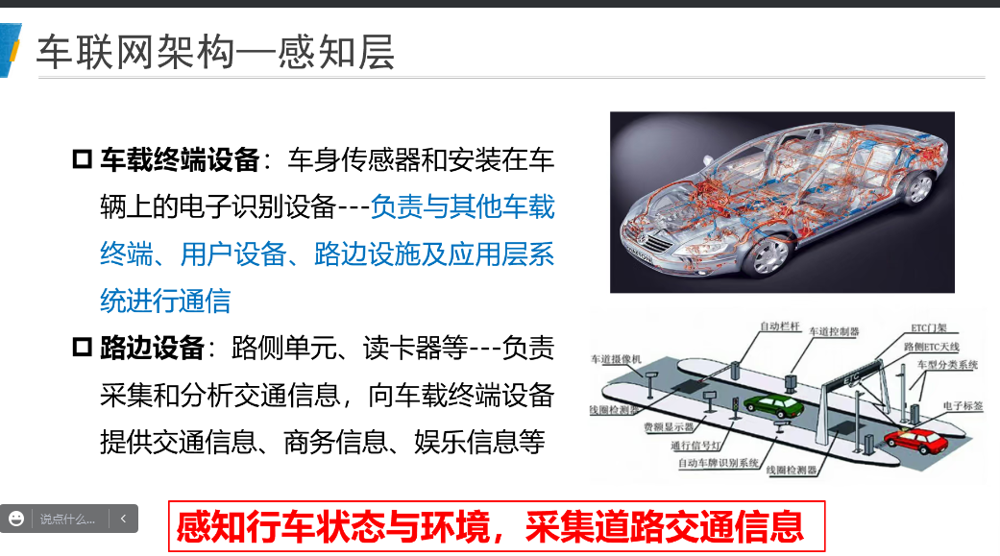

## 网络层
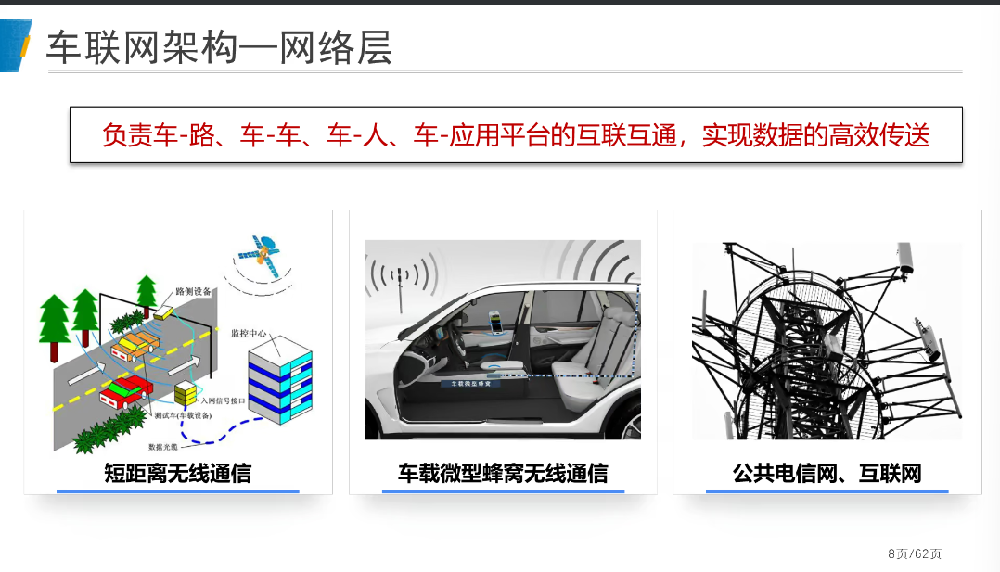

## 应用层

# System Model
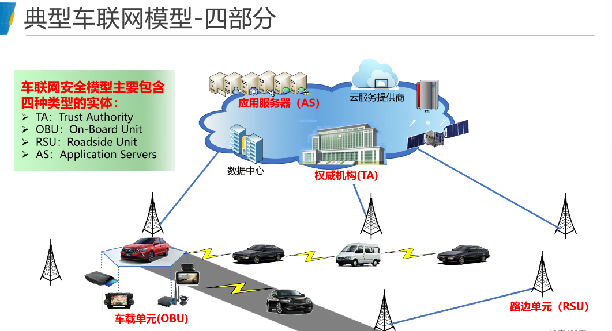
5G
车辆和路边单元的算力增大，新能源车，电车作为节点
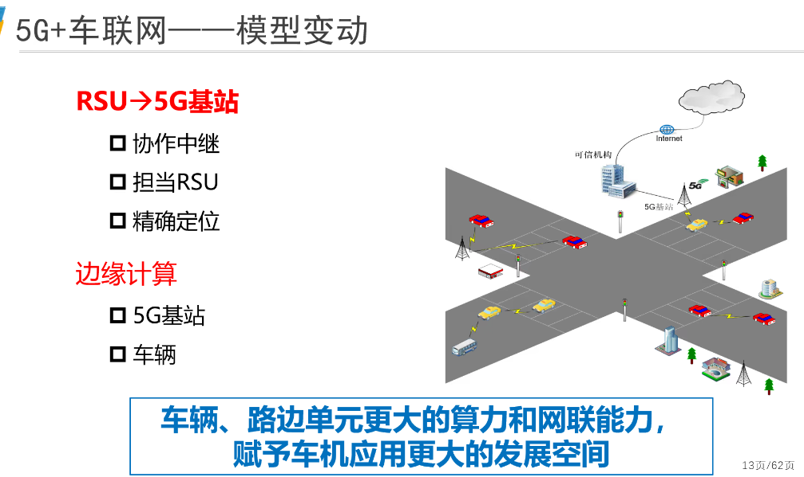

# 安全问题
## 红绿灯
## 伪造虚假交通信息
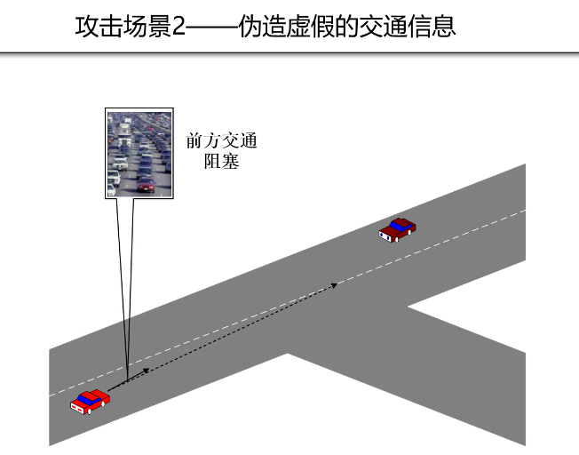
## 黑客
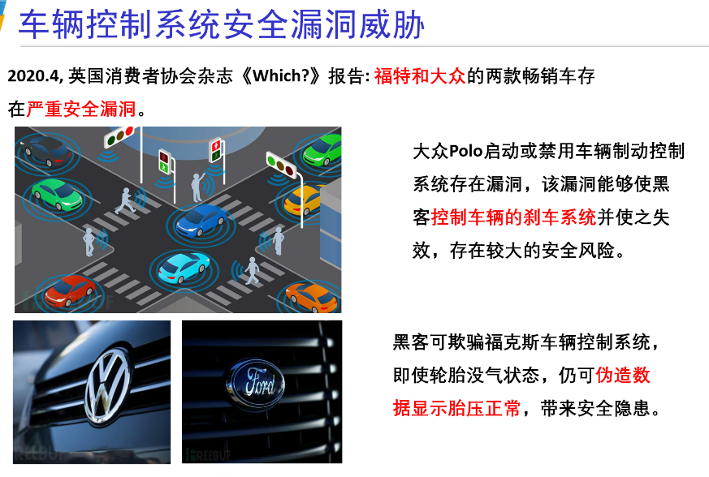
## 车辆行驶轨迹
# 攻击
## 内部外部攻击
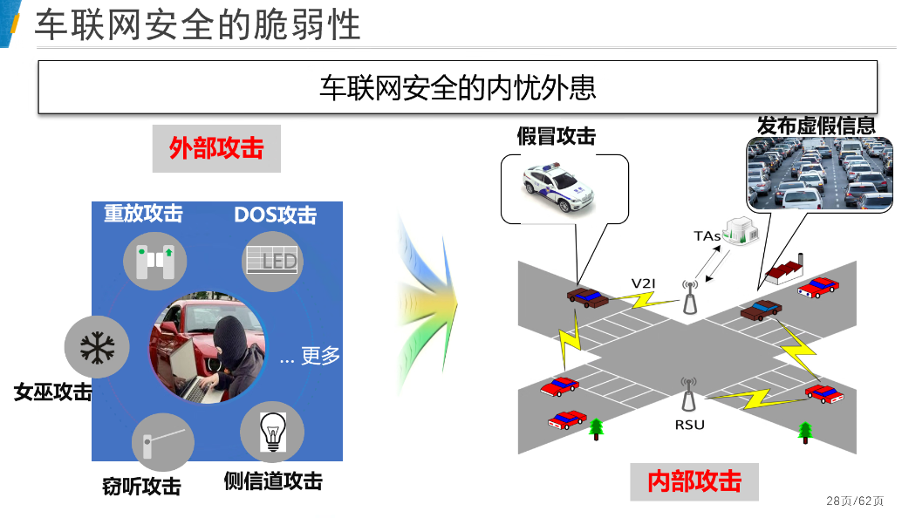
## 中间人攻击
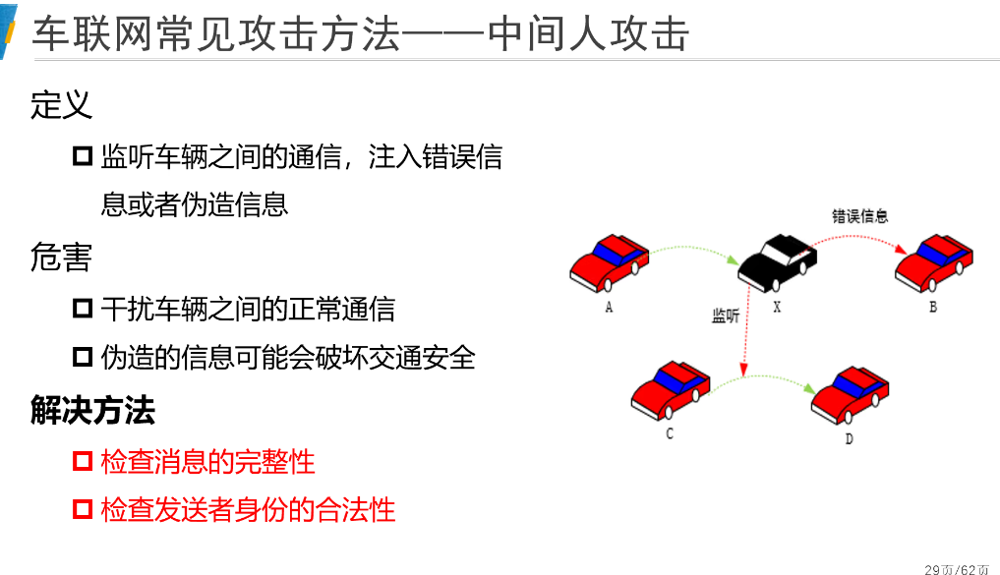
## 女巫攻击
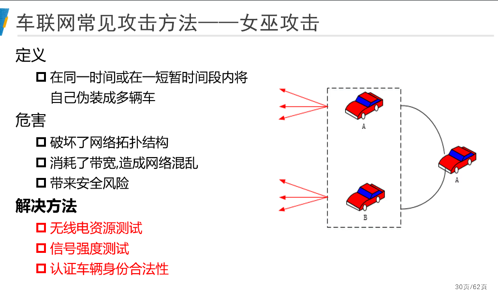
## 安全要求
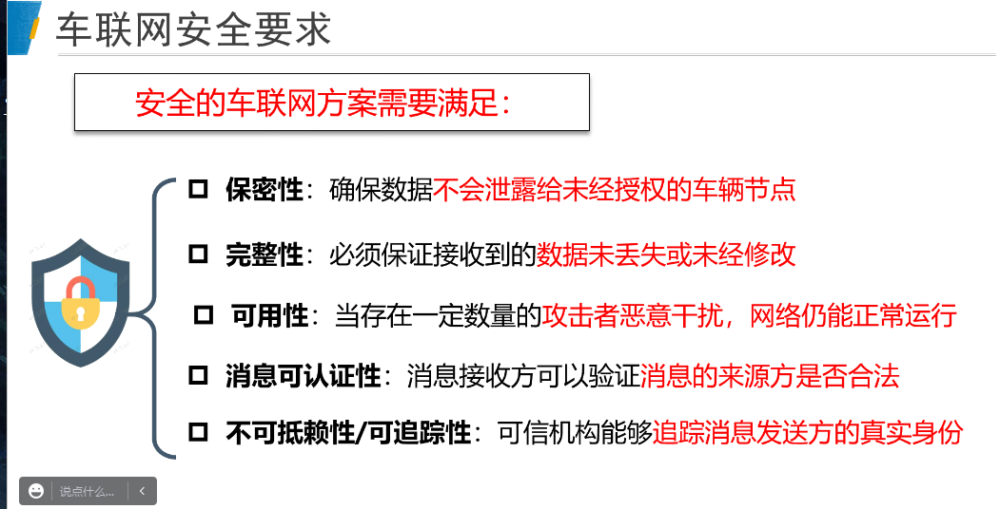
# 研究现状
## 认证因子
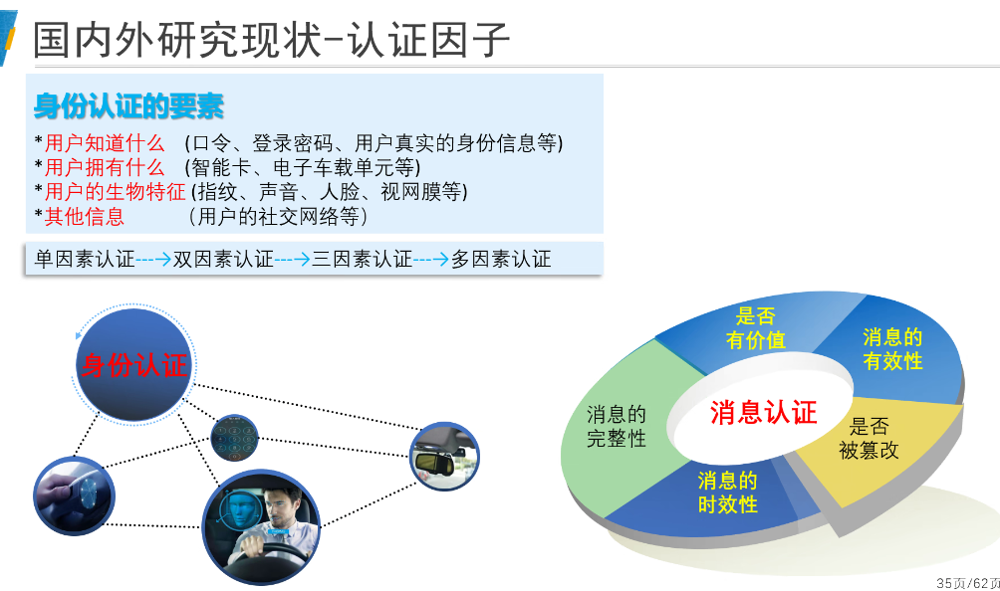

## 技术方法
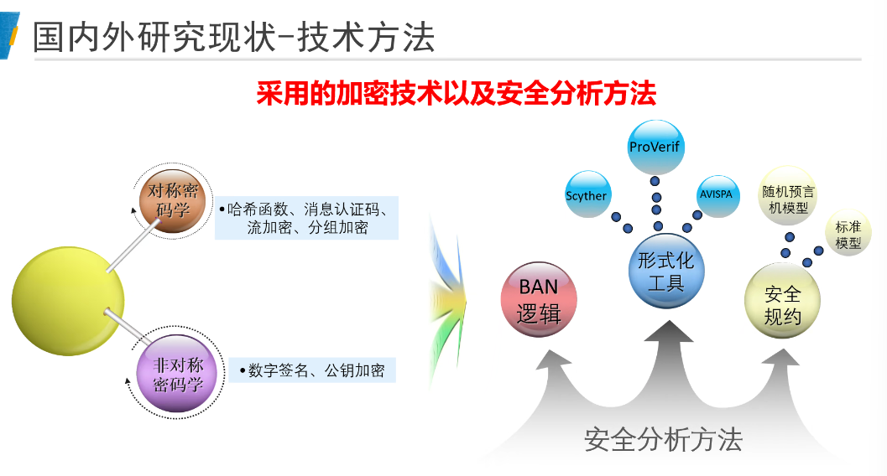

# 课题组
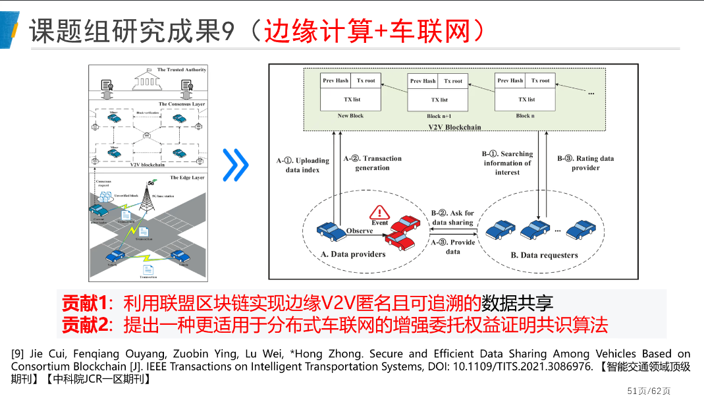